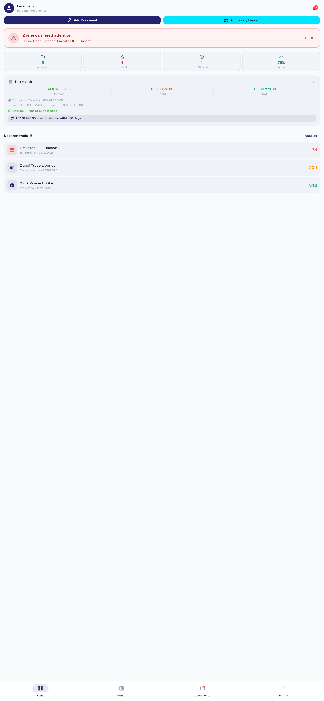
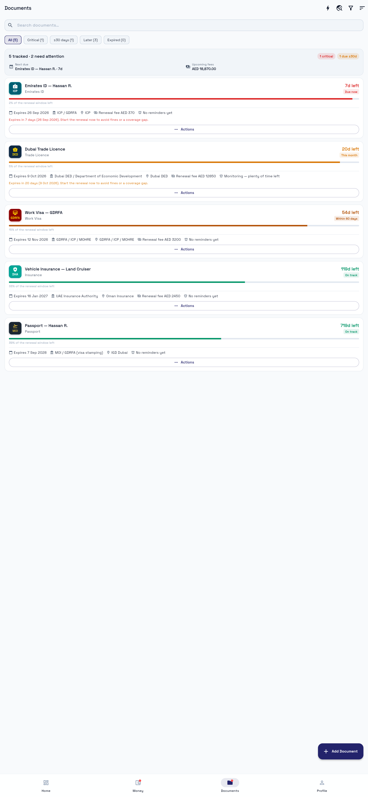
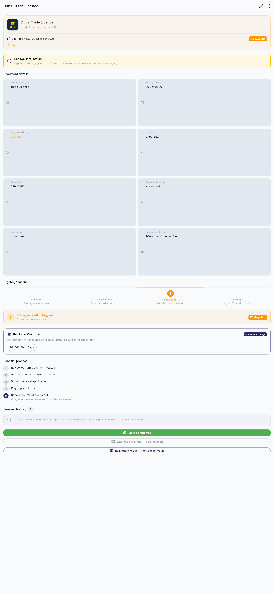
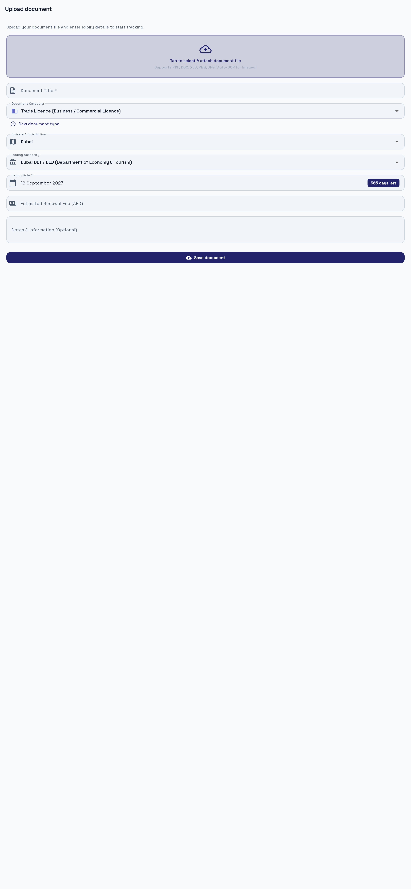
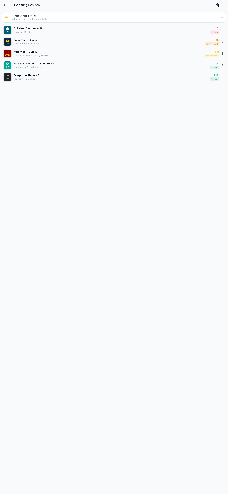
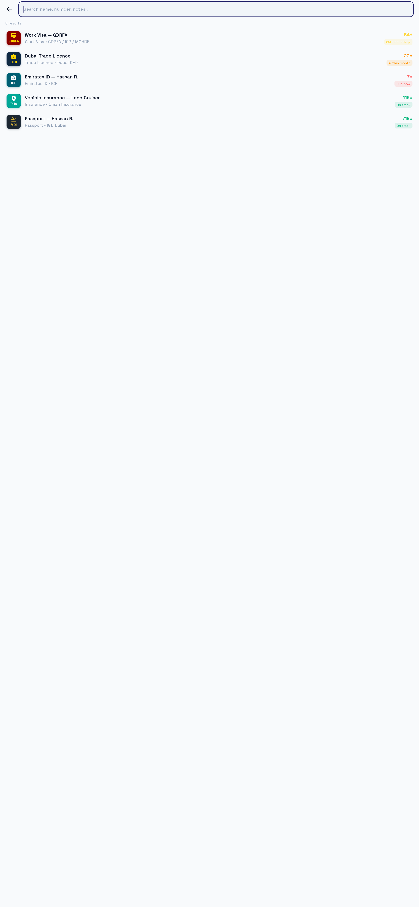
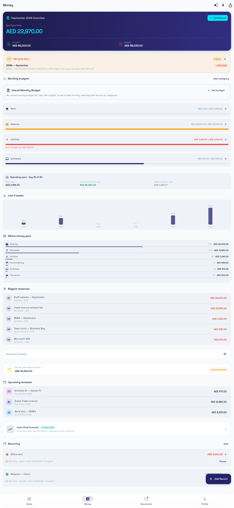
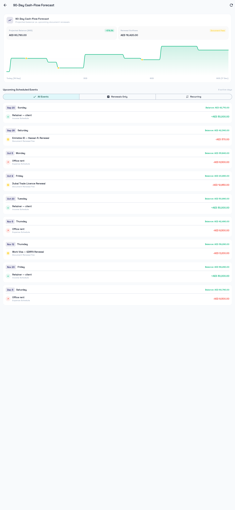
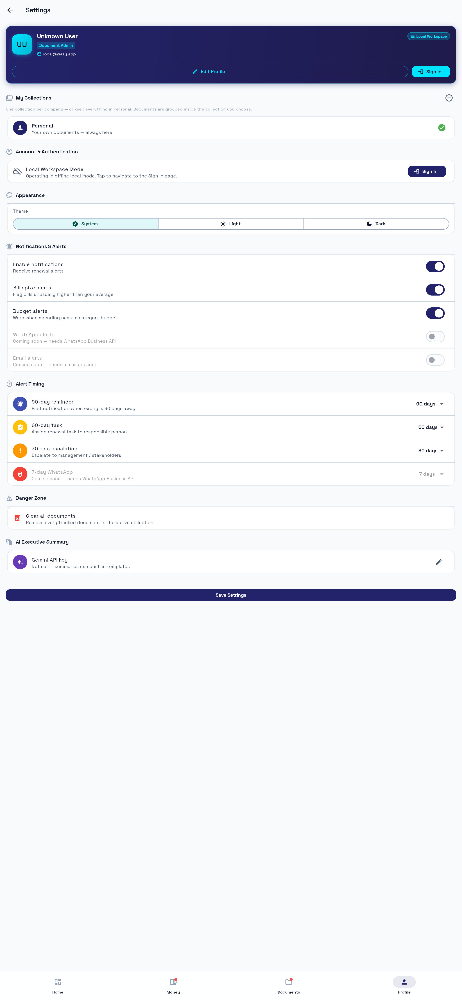

# Wazy — Technical Documentation

> Version 1.0.0 · Flutter 3.x / Dart ^3.11 · Backend: Supabase (PostgreSQL + Auth)
> Audience: developers joining the project. Read this top-to-bottom once; keep [docs/README.md](README.md) bookmarked.

Wazy is an AI-powered financial budgeting & cash-flow intelligence app with integrated personal/company document expiry tracking, built for the UAE market. One Flutter codebase ships to Android and iOS; a web build exists for the demo/docs flow.

---

## Table of contents

1. [System overview](#1-system-overview)
2. [Architecture](#2-architecture)
3. [Data model](#3-data-model)
4. [Offline-first sync engine](#4-offline-first-sync-engine)
5. [Feature reference (with screenshots)](#5-feature-reference-with-screenshots)
6. [Alerts & notifications](#6-alerts--notifications)
7. [Project layout](#7-project-layout)
8. [Build, run, test](#8-build-run-test)
9. [Database migrations](#9-database-migrations)
10. [Known limitations & roadmap](#10-known-limitations--roadmap)

---

## 1. System overview

```
┌────────────────────────────┐         ┌─────────────────────────────────┐
│  Flutter app (iOS/Android) │         │  Supabase project               │
│                            │         │                                 │
│  UI (screens/widgets)      │  HTTPS  │  ├─ PostgreSQL (RLS per user)   │
│      │                     │ ──────► │  │    collections               │
│  Service layer             │  REST   │  │    documents                 │
│  (ChangeNotifier singletons│         │  │    finance_*                 │
│   + local cache)           │ ◄────── │  ├─ Auth (email/password)       │
│      │                     │         │  ├─ Storage (future: attachments)│
│  SharedPreferences cache   │  push   │  └─ pg_cron → reminders scan    │
│  + outbox queue            │ (local) │                                 │
└────────────────────────────┘         └─────────────────────────────────┘
```

**Design rule:** the local cache is always the source of truth for the UI. Supabase is synced in the background; failures degrade to "sync later", never to a broken screen.

**Local-only mode:** if no Supabase credentials are configured (`lib/config/app_credentials.dart`), every service silently operates on the local cache. The app is fully usable offline, forever. This is also how unit tests run.

---

## 2. Architecture

### 2.1 Layers

| Layer | Location | Pattern |
|---|---|---|
| Presentation | `lib/screens/`, `lib/widgets/` | Stateless widgets consuming service singletons; `go_router` for navigation (hash routing on web) |
| Application services | `lib/services/` | `ChangeNotifier` singletons (`X.instance`); own loading, caching, and remote sync |
| Domain models | `lib/models/` | Immutable data classes with `fromJson`/`toJson` + pure computation helpers (`FinanceMath`, `RecurrenceMath`, `DocSync`, `UrgencyLevel`) |
| Persistence | Supabase tables + `SharedPreferences` | Remote-first when configured, local-first otherwise |
| Cross-cutting | `lib/theme/`, `lib/config/` | `WazyTheme` light/dark; credentials constants |

### 2.2 Key services

| Service | Responsibility |
|---|---|
| `SupabaseService` | One-time init, `clientOrNull` (never throws — callers degrade gracefully) |
| `AuthService` | Session restore, `currentUserId` |
| `DocumentCollectionService` | Personal + company collections; active-collection selection |
| `DocumentScannerService` | The document store: CRUD, search, renewal, outbox sync, row mapping |
| `FinanceService` | Transactions, budgets, envelopes, recurring templates, cash-flow inputs |
| `NotificationService` | OS-level reminder ladder (90/60/30/7 days) + budget alerts via `flutter_local_notifications` |
| `BudgetAlertService` / `AlertPreferencesService` | 80%/100% budget alert engine and per-user toggles |
| `SmartCategoryEngine` | Levenshtein + UAE vendor dictionary auto-categorization with habit learning |
| `AnomalyDetectionService` | Moving-average/σ bill-spike detection |
| `UaeDocumentOcrService` | ML Kit text recognition → structured UAE document fields |
| `NaturalLanguageParserService` | "Paid AED 450 for DEWA yesterday" → transaction drafts |
| `GeminiApiService` | Optional LLM features (key optional) |
| `AppVersionService` | Splash-time version check against an `app_versions` table |

### 2.3 Navigation

`lib/router.dart` — `go_router` with an auth redirect gate (active only when Supabase is configured):

- `/` splash → `/onboarding` (first run) or `/home`
- `/login` when auth is available but no session
- Full-screen routes above the shell: `/scan`, `/document/:id`, `/document/:id/edit`, `/search`, `/expiry-list`, `/cash-flow-forecast`
- `StatefulShellRoute.indexedStack` with 4 branches: `/home`, `/money`, `/documents`, `/profile` — bottom nav with live badges (documents needing attention; budget 80/100% dot)

---

## 3. Data model

### 3.1 Supabase tables (see `supabase/schema.sql`, `supabase/finance_schema.sql`)

**`collections`** — one built-in Personal row per user (`is_personal`, unique per owner) + optional company collections.

**`documents`** — the core table:

| Column | Type | Notes |
|---|---|---|
| `id` | uuid PK | client-generated (uuid v4) |
| `owner_id` | uuid → auth.users | RLS-scoped |
| `collection_id` | uuid → collections | FK; local pseudo ids are remapped on push |
| `doc_type` | text | built-in key (e.g. `tradeLicence`) or `custom-<uuid>` |
| `display_name` | text | |
| `expires_at` | date | |
| `reminder_days` | int | default 30 (14 for software subscriptions) |
| `status` | text | `active` / `renewed` / `expired` / `archived` |
| `assigned_to` | text | |
| `renewal_fee` | numeric(10,2) | |
| `notes` | text | description or fallback warning |
| `file_name` / `file_path` / `file_size` | text / text / bigint | attachment metadata; the file itself lives on-device |
| `location` | text | issuing authority + emirate as entered (synced since v1.1) |
| `renewal_history` | jsonb | array of `RenewalRecord` objects (synced since v1.1) |
| `custom_reminder_days` | int[] | user alert offsets overriding the 90/60/30/7 ladder (synced since v1.1) |
| `created_at` / `updated_at` | timestamptz | `updated_at` maintained by the `trg_documents_updated_at` trigger — the client never sends it |

**`reminders`** — notification log (document, `remind_at`, channel `push/email/whatsapp`, `sent_at`). Populated by the `create_due_reminders()` pg_cron job daily at 06:00 UTC.

**`custom_document_types`** — user-defined doc types (`unique(owner_id, name)`), referenced from `documents.doc_type` as `custom-<id>`.

**Finance:** `finance_transactions` (income/expense lines, optional `document_id` link), `category_budgets` (per-category monthly limits), `savings_envelopes` (goals; tracking only — no money movement, per the pre-licence fintech stance), `recurring_transactions` (templates auto-logged by `FinanceService.runDueRecurrences()`).

**`app_versions`** — used by the splash update check (`supabase/app_version_schema.sql`).

### 3.2 RLS model

Every table has row-level security enabled with per-owner policies (`auth.uid() = owner_id`), either directly (`collections`, `documents`, `custom_document_types`) or via an `exists` subquery through the parent document (`reminders`). Only the anon (publishable) key ships in the app.

### 3.3 Local cache

| Key | Contents |
|---|---|
| `local_documents_v1` | JSON array of `ExpiryItem.toJson()` |
| `local_documents_outbox_v1` | JSON array of `PendingOp` (queued mutations) |
| `financeRecords.v1` | `{transactions, budgets, envelopes, recurring, overallBudgets}` |
| `hasOnboarded` | onboarding flag |
| `activeCollectionId` | collection selection |

Derived fields (`daysRemaining`, `urgency`, `isExpired`) are **recomputed on read**, never trusted from storage.

---

## 4. Offline-first sync engine

The full contract lives in `lib/services/doc_sync.dart` (pure, unit-tested) and is executed by `DocumentScannerService`.

### 4.1 Write path

```
save → local cache update (instant UI)
     → enqueue PendingOp.upsert (persisted outbox)
     → best-effort Supabase insert/update
        ├─ success → remove from outbox
        └─ failure → stays queued (replayed on next init/refresh)
```

### 4.2 Row sanitization

Every row sent to PostgREST is filtered through `_documentRowColumns`, a whitelist of real schema columns. This prevents a class of silent sync death: an app version that emits a key the table doesn't have (the historical `updated_at_client` bug) would otherwise be rejected with PGRST204 on every attempt, forever. Stale outbox entries written by older versions are sanitized at replay time.

### 4.3 Pull / merge (last-writer-wins)

On init and pull-to-refresh: queued mutations are flushed **before** pulling (so offline-created rows exist server-side), then remote rows merge into the cache via `DocSync.merge`:

- local dirty (unsynced edit) → keep local, re-queue push
- remote `updated_at` newer → take remote
- local newer → keep local
- tie / missing → remote wins (server authoritative)
- remote row gone + local clean → drop (deleted elsewhere); local dirty → keep and resurrect on next push

Collection ids: local-only pseudo ids (`personal`, `local-<ts>`) are remapped to the user's real personal-collection uuid before any push — otherwise the FK would reject the write.

### 4.4 Timestamps

`updatedAt` is stamped on every local mutation for LWW comparisons. The server-side `updated_at` trigger is authoritative for change detection; the client never transmits a timestamp column.

---

## 5. Feature reference (with screenshots)

All screenshots live in [`docs/images/`](images/). They were captured from a real web build running against seeded demo data (see `tool/capture_screens.mjs`).

### 5.1 Splash & version gate

Auto-checks the `app_versions` table; can prompt or force an update before continuing.



### 5.2 Onboarding

Three-panel intro; the `hasOnboarded` flag skips it on later launches.


### 5.3 Home dashboard

Cross-tier summary: attention banner (documents ≤30 days), stat tiles (total/critical/≤30d/budget), this-month income/spend/net with pace projection, renewal-outlook bar, and the next renewals list.


### 5.4 Documents

The expiry radar. Every card shows urgency color, renewal-window progress, authority, fee, reminder state, and an expiry-aware warning (`effectiveRenewalWarning` — never blank). Filter chips: All / Critical / ≤30 days / Later / Expired.



### 5.5 Document detail

Full record: urgency timeline (reminder → task → escalation → WhatsApp), reminder overrides (custom alert days), renewal process checklist, renewal history, mark-as-renewed flow, and attachment handling. The **Renewal information** card uses the expiry-aware fallback so it always shows meaningful guidance.



### 5.6 Upload / scan (OCR)

Attach PDF/DOC/XLS/PNG/JPG. Images run through ML Kit OCR (`UaeDocumentOcrService`) which pre-fills title, type, expiry, emirate, authority and document number — the user reviews before saving. Files are copied to the app documents directory; metadata is stored with the record.



### 5.7 Expiry list & report

Flat chronological view across the collection with CSV/PDF export (`ExpiryReport`).



### 5.8 Global search

Fuzzy search across names, notes, authorities, assignees, file names and type names, over every collection.



### 5.9 Money

Finance module home: month overview (net cash flow), bill-spike alert, overall + per-category budgets with 80/100% alert thresholds, spending pace (avg/day, projected month-end, safe-to-spend), 6-week bar chart, category breakdown, biggest expenses, executive summary, 90-day renewal outlook, upcoming renewals with fees, cash-flow forecast entry, and recurring templates.



### 5.10 90-day cash-flow forecast

Simulates daily balances from history + recurring templates + upcoming renewal fees; shows projected end balance, lowest point, and a filterable event list (all / renewals only / recurring).



### 5.11 Profile

Collections management, alert preferences, theme, and account.



---

## 6. Alerts & notifications

| Mechanism | Trigger | Implementation |
|---|---|---|
| Renewal ladder | 90/60/30/7 days before `expires_at` | `NotificationService.scheduleEscalationLadder` — OS-local notifications (`flutter_local_notifications` + timezone Asia/Dubai); re-synced on every app start (`resyncAll`) |
| Custom offsets | `custom_reminder_days` overrides the ladder per document | Same engine, custom list; cancel uses the same offsets |
| Budget 80% | category spend ≥ 80% of monthly limit | `BudgetAlertService` evaluates on every finance change; one alert per budget/month/threshold (`alertKey` dedupe) |
| Budget 100% | spend ≥ 100% | same, separate dedupe key; Money-tab badge turns red |
| Bill spike | bill > baseline + σ | `AnomalyDetectionService` moving average over history |
| Server reminders | daily pg_cron `create_due_reminders()` | inserts `reminders` rows for active docs inside their reminder window (future Edge Function/FCM consumer) |

WhatsApp/email alerts are intentionally not wired: secrets must never ship in the client. The UI surfaces them as "coming soon" pending a Supabase Edge Function + provider integration.

---

## 7. Project layout

```
lib/
  main.dart               startup: theme, Supabase, alert prefs, prewarm
  app.dart                MaterialApp.router + theme wiring
  router.dart             go_router config, auth gate, shell + badges
  config/
    app_credentials.dart  Supabase URL + anon key (compiled in)
    app_links.dart        deep-link config
  models/                 ExpiryItem, DocumentType(+Registry), DocumentCollection,
                          RenewalRecord, FinanceTransaction/Budget/Envelope/Recurring,
                          CashFlow*, FinanceMath, RecurrenceMath
  services/               one singleton per concern (see §2.2); doc_sync.dart = sync contract
  screens/                12 screens (splash, onboarding, login, home, documents,
                          scan, detail, expiry list, search, money, cash flow, profile)
  widgets/                shared components + dialogs (renew, urgency, legal, version…)
  theme/app_theme.dart    WazyColors + light/dark themes
supabase/
  schema.sql              documents/collections/reminders/custom types + RLS + cron
  finance_schema.sql      finance tables + RLS
  app_version_schema.sql  app_versions
  migrate_companies_to_collections.sql        legacy single-company → collections
  migrate_documents_local_only_fields.sql     adds location, renewal_history,
                                              custom_reminder_days
test/                     20 suites — sync contract (DocSync), finance math,
                          recurrence, anomaly, categories, OCR parser, widgets
tool/capture_screens.mjs  docs screenshot generator (seeded web build)
```

---

## 8. Build, run, test

```bash
# Prerequisites: Flutter ^3.11, a Supabase project for sync features

flutter pub get

# Configure backend (or skip for local-only mode):
#   edit lib/config/app_credentials.dart → supabaseUrl / supabaseAnonKey
#   run supabase/schema.sql + finance_schema.sql (+ migrations) in the SQL editor

flutter run                    # device/emulator
flutter run -d chrome          # web (hash routing)
flutter build web --release
flutter build apk --release    # Android (configure signing first — see PRODUCTION_READINESS.md)

flutter analyze
flutter test                   # 20 suites
```

** regenerate docs screenshots:**
```bash
flutter build web --release
node tool/capture_screens.mjs   # writes docs/images/*.png
```
The script stubs credentials for a local-only build automatically? No — it expects the build to be in local-only mode. Temporarily blank the credentials in `lib/config/app_credentials.dart`, rebuild, run the script, then `git checkout -- lib/config/app_credentials.dart`.

---

## 9. Database migrations

| File | When to run |
|---|---|
| `supabase/schema.sql` | fresh projects (idempotent — safe to re-run) |
| `supabase/migrate_companies_to_collections.sql` | legacy single-company projects |
| `supabase/migrate_documents_local_only_fields.sql` | all existing projects — adds `location`, `renewal_history`, `custom_reminder_days` |
| `supabase/finance_schema.sql` | any project without the finance tables |
| `supabase/app_version_schema.sql` | to enable the splash update check |

All migrations are additive and idempotent. After running the fields migration, the app uploads previously local-only fields on the next save/sync; stale outbox entries are healed by the row sanitizer (§4.2).

---

## 10. Known limitations & roadmap

| Area | Status | Notes |
|---|---|---|
| Attachment files | device-local | metadata syncs; bytes don't. Supabase Storage bucket is the planned fix |
| OS notification reschedule on pull | not automatic | a remote edit (e.g. custom reminder days) reschedules on next local edit/renewal, not on pull — needs post-merge resync hook |
| WhatsApp / email alerts | not wired | requires server-side provider (Meta Cloud API / SMTP) behind an Edge Function |
| Push (FCM/APNs) | not wired | local notifications only; server `reminders` rows are ready as the data source |
| Release signing | debug keys on Android | see PRODUCTION_READINESS.md checklist |
| Web platform | demo/docs only | ML Kit & local notifications degrade on web |
| Localization | English only | strings inline, RTL-ready layout not audited |
